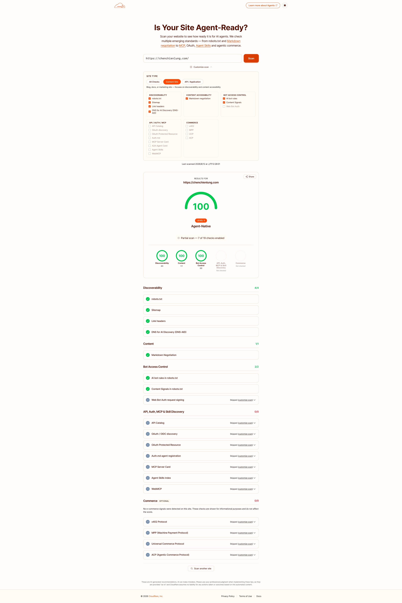

# 個人作品集 Portfolio

這是一個使用 Vue 3、Vite 與 Tailwind CSS 開發的個人作品集網站，並透過 Supabase 進行資料庫的串接管理。用於展示個人的專案作品介紹、設計理念與網站等作品相關連結。

[](https://vuejs.org/)
[](https://www.typescriptlang.org/)
[](https://tailwindcss.com/)
[](https://vite.dev/)
[](https://supabase.com/)
[](https://pages.cloudflare.com/)
[](https://isitagentready.com/chenchienlung.com?profile=content)

**網站:** https://chenchienlung.com/


---

## 使用到的技術


- **前端框架**: [Vue 3](https://vuejs.org/)
- **建構工具**: [Vite](https://vitejs.dev/)
- **CSS框架**: [Tailwind CSS](https://tailwindcss.com/)
- **作品資料庫**: [Supabase](https://supabase.com/)
- **作品圖庫**: [Cloudinary](https://cloudinary.com/)
- **路由管理**: [Vue Router](https://router.vuejs.org/)
- **型別定義**: [TypeScript](https://www.typescriptlang.org/)
- **圖示庫**: [FontAwesome](https://fontawesome.com/) | [theSVG](https://www.thesvg.org/)

## 本機開發

本專案是依照個人作品集需求客製設計與開發，並非通用型網站模板。以下步驟主要提供給專案維護、功能調整或面試展示時使用。

### 安裝依賴

```bash
npm install
```

### 設定環境變數

複製 `.env.example` 為 `.env`：

```bash
cp .env.example .env
```

再填入 Supabase 與網站網址：

```env
VITE_SUPABASE_URL=https://your-project.supabase.co
VITE_SUPABASE_PUBLISHABLE_KEY=your-publishable-key
VITE_SITE_URL=https://your-domain.com
```

### 啟動開發伺服器

```bash
npm run dev
```

啟動後開啟 http://localhost:5173。

### 常用指令

| 指令                           | 用途                                 |
| ------------------------------ | ------------------------------------ |
| `npm run dev`                  | 啟動開發伺服器                       |
| `npm run type-check`           | 執行 TypeScript 型別檢查             |
| `npm run generate-agent-ready` | 從 Supabase 產生 Markdown 與索引檔案 |
| `npm run build`                | 執行型別檢查並建立正式版本           |
| `npm run preview`              | 預覽正式建置結果                     |
| `npm run format`               | 格式化前端程式碼                     |

## 專案結構

- `src/views/`：頁面
- `src/components/`：共用元件
- `src/lib/`：Supabase 與共用邏輯
- `scripts/`：建置前的資料產生腳本
- `public/`：公開靜態資源與 Agent Ready 資源

## 部署

- **網域註冊**: [Cloudflare Registrar](https://cloudflare.com/)
- **部署**: [Cloudflare Pages](https://pages.cloudflare.com/)

### Cloudflare Pages 設定

- **Build command**：`npm run build`
- **Build output directory**：`dist`
- **Production branch**：`main`
- **Node.js**：24 LTS

Supabase 的資料異動會透過 Database Webhook 觸發 Cloudflare Pages Deploy Hook，讓作品與文章更新後自動重新建置網站。

## AI Agent Ready 資源產生流程

作品與文章的 Agent Ready Markdown 內容會從 Supabase 自動產生，不需要手動建立或維護每一頁。

### 本機產生

```bash
npm run generate-agent-ready
```

這個指令會讀取 Supabase 的 `projects` 與 `articles` 資料，並產生：

- `public/markdown/portfolio/<slug>.md`：每個公開作品的詳細 Markdown
- `public/markdown/blog/<slug>.md`：每篇已發布文章的詳細 Markdown
- `public/markdown/home.md`：首頁 Markdown
- `public/markdown/portfolio.md`：作品集索引 Markdown
- `public/markdown/blog.md`：文章索引 Markdown
- `public/llms-full.txt`：完整索引與各項 Markdown 資源連結
- `public/portfolio.json`：機器可讀的作品、文章資料與 Markdown URL
- `public/sitemap.xml`：網站頁面索引

`functions/[[path]].js` 會處理 `Accept: text/markdown` 請求。AI Agent 請求首頁、作品集、文章列表或詳細頁時，會回傳對應的 Markdown；一般瀏覽器請求則維持回傳 HTML。

### 自動部署流程

完成 Supabase Database Webhook 與 Cloudflare Pages Deploy Hook 設定後，Supabase 的 `INSERT`、`UPDATE`、`DELETE` 事件會觸發 Cloudflare Pages 重新部署。

Cloudflare 建置時會執行 `npm run build`，先從 Supabase 讀取最新資料，再產生 Markdown、`llms-full.txt`、`portfolio.json` 與 `sitemap.xml`，最後完成 Vite 建置。

流程如下：

```text
Supabase 資料異動
  → Supabase Database Webhook
  → Cloudflare Pages Deploy Hook
  → npm run build
  → 重新產生 Markdown、llms-full.txt、portfolio.json、sitemap.xml
  → Cloudflare Pages 發布
```

## 特色與架構

- **動態內容讀取**: 所有的專案內容，包括標題、設計理念介紹 (支援圖文左右交錯排版)、標籤以及各式外部連結等，皆由 Supabase 動態請求並渲染。
- **模組化元件**: 利用 Vue 元件化特性將介面拆分 (例如 `ProjectCard.vue`, `ProjectDetail.vue`, `ProjectLinks.vue` 等)，達到高重用性與易維護性。
- **響應式設計 (RWD)**: 透過 Tailwind CSS 快速實作各種螢幕尺寸的響應式介面，確保手機及桌面端的良好瀏覽體驗。
- **深色模式**: 支援 light / dark 模式切換。
- **AI Agent Ready**: 提供 `llms.txt`、`llms-full.txt`、`portfolio.json`、網站 Sitemap 與可由 `Accept: text/markdown` 取得的 Markdown 資源，讓 AI Agent 更容易探索與理解網站內容。

## Agent Ready 驗證

目前的 Agent Ready 實作可透過線上檢測與 HTTP 回應共同驗證：

- [查看線上檢測結果](https://isitagentready.com/chenchienlung.com?profile=content)
- [網站 Markdown 索引](https://chenchienlung.com/llms-full.txt)
- [機器可讀作品資料](https://chenchienlung.com/portfolio.json)

### 線上掃描結果

使用 Cloudflare 提供的檢測網站：https://isitagentready.com/ 測出結果如下：

[](https://isitagentready.com/chenchienlung.com?profile=content)

點擊圖片可以開啟目前網站的線上檢測頁面。

> 備註：本專案僅有掃描 Content Site，因為本專案是個人作品集網站，目前沒有提供 API/MCP/Skills/Auth/金流 等功能與服務。這些項目不適用於本專案，不代表檢測失敗或尚未完成。

測試 Markdown 內容協商：

```bash
curl -i \
  -H "Accept: text/markdown" \
  https://chenchienlung.com/portfolio/wantrip
```

預期回應包含：

```http
content-type: text/markdown
vary: Accept
```

檢測截圖可以作為補充證明，但由於檢測結果可能隨網站內容與規則更新，README 以線上檢測連結、公開資源與實際 HTTP 回應作為主要證明會更可靠。

## 截圖

### Desktop

#### light


#### dark


### Mobile

#### light


#### dark


